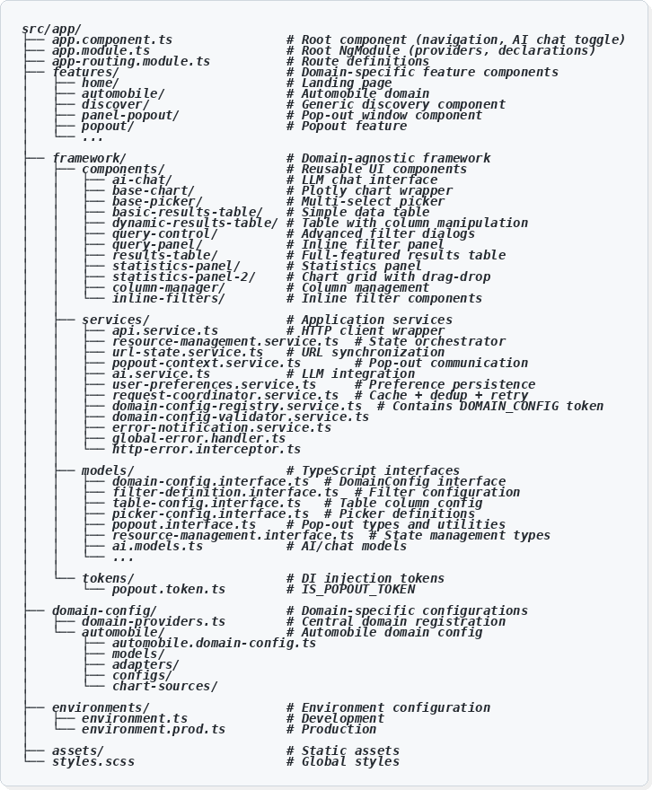

---

### Feature Components

| Framework (Never Changes) | Domain-Specific (Per Domain) |
|---------------------------|------------------------------|
| `HomeComponent` | — |
| `PopoutComponent` | — |
| — | `AutomobileComponent` (landing) |
| — | `AutomobileDiscoverComponent` (main page) |

**Pattern:** The discover page is domain-specific because it wires up domain configuration. Popout is framework because it renders any domain's panels.

---

### Routes

| Framework (Never Changes) | Domain-Specific (Per Domain) |
|---------------------------|------------------------------|
| `/` (redirect) | — |
| `/home` | — |
| `/popout/:gridId/:componentId` | — |
| — | `/automobiles` |
| — | `/automobiles/discover` |

---

## Directory Structure

**Figure 053.1** provides a visual overview of the directory structure, color-coded to distinguish framework code from domain-specific code:



*Figure 053.1: Directory structure of the vvroom application. Framework code (blue) is reusable across all domains. Domain-specific code (green) contains automobile-specific models, adapters, and configurations.*

The text representation below provides the same information for reference:

```
src/
├── app/
│   ├── app.component.ts           # Framework
│   ├── app.config.ts              # Framework
│   ├── app.routes.ts              # Framework + Domain routes
│   └── features/
│       ├── home/                  # Framework
│       ├── popout/                # Framework
│       └── automobile/            # DOMAIN-SPECIFIC
│           ├── automobile.component.ts
│           └── automobile-discover/
│
├── framework/                     # ALL FRAMEWORK
│   ├── components/
│   ├── models/
│   ├── services/
│   └── tokens/
│
├── domain-config/                 # ALL DOMAIN-SPECIFIC
│   ├── domain-providers.ts        # Registers all domains
│   └── automobile/
│       ├── adapters/
│       ├── chart-sources/
│       ├── configs/
│       ├── models/
│       ├── automobile.domain-config.ts
│       └── index.ts
│
└── environments/                  # Framework
```

---

## Observable Streams (Framework)

These observable names are **framework conventions** — they don't change per domain:

| Observable | Type | Description |
|------------|------|-------------|
| `state$` | `Observable<ResourceState>` | Complete state object |
| `filters$` | `Observable<TFilters>` | Current filter values |
| `results$` | `Observable<TData[]>` | Current page results |
| `totalResults$` | `Observable<number>` | Total count |
| `loading$` | `Observable<boolean>` | Loading state |
| `error$` | `Observable<Error \| null>` | Error state |
| `statistics$` | `Observable<TStats>` | Statistics data |
| `highlights$` | `Observable<any>` | Highlight filters |